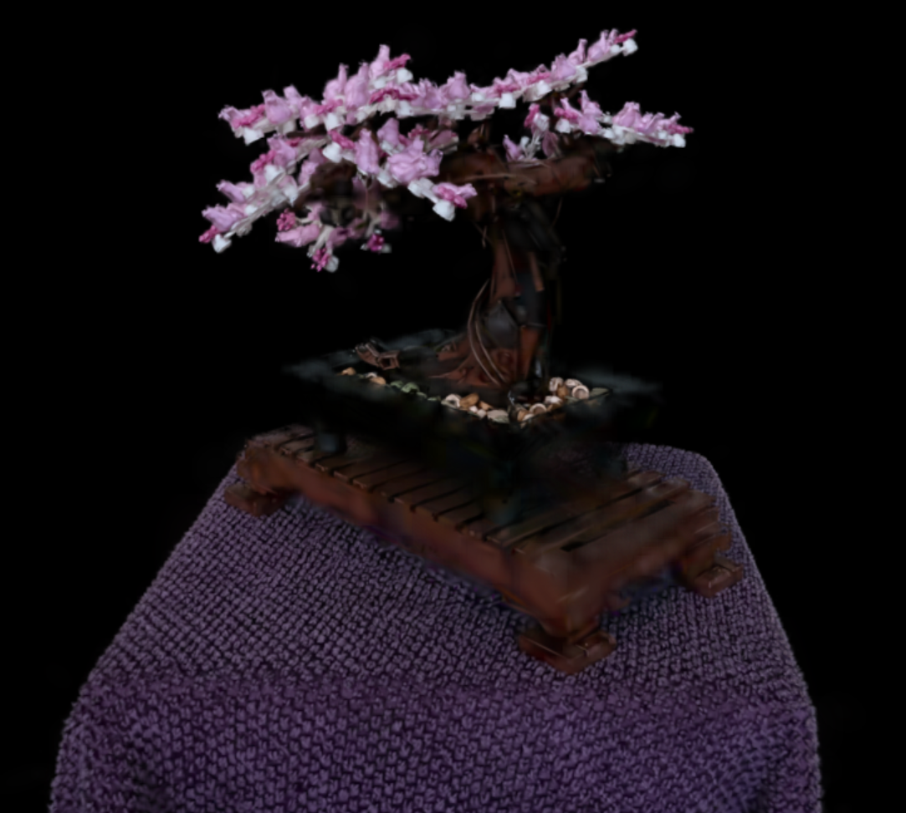

# Project5-WebGPU-Gaussian-Splat-Viewer

**University of Pennsylvania, CIS 565: GPU Programming and Architecture, Project 5**

* Raymond Feng
  * [LinkedIn](https://www.linkedin.com/in/raymond-ma-feng/), [personal website](https://www.rfeng.dev/)
* Tested on: Windows 11, i9-9900KF @ 3.60GHz 32GB, NVIDIA GeForce RTX 2070 SUPER (Personal Computer)

## [🚀 Live Deployment 🚀](https://sgmq0.github.io/Project4-WebGPU-Forward-Plus-and-Clustered-Deferred/)

### Demo Video/GIF

### Project Overview
The goal of this project was to create a gaussian splat viewer in WebGPU. It implements the [3D Gaussian Splatting for Real-Time Radiance Field Rendering](https://repo-sam.inria.fr/fungraph/3d-gaussian-splatting/) paper from SIGGRAPH 2023.

Gaussian splats are a modern way of viewing 3D scenes, in which shapes known as Gaussians are scattered across the screen rather than using a traditional mesh. These gaussians each store data such as position, opacity and transformations.

#### 1. Precomputation
Before setting up any kind of rendering, we need to precompute all the splat data inside a compute shader. The goal is to take all the point cloud data, which contains what is essentially vertex information for the gaussians, and convert it into a splat.

First, this preprocessing step handles all the transformations from world space to normalized device coordinates. It also handles frustum culling-- Because it calculates the points in screen space, it's as simple as checking if the point's x and y position is within a certain threshold.

Referencing [these notes](https://github.com/kwea123/gaussian_splatting_notes) as well as the original paper's [implementation](https://github.com/graphdeco-inria/diff-gaussian-rasterization), we can compute a gaussian's 3D covariance, 2D covariance, and radius. These can then be used to determine its position, color, conic, and opacity, all of which will be used in the vertex and fragment shader to render a nice output.

#### 2. Rendering
After precomputing splat data, we can now run our render pass. Our rendering pipeline uses indirect draws to draw a quad for every splat. Then, using the conic we calculated in the precomputation pass, we can give every quad an opacity falloff, which gives it an ovular shape.

Combining every splat, we end up with a decent-ish image as seen above. Obviously it's not perfect, but it's good enough.

### Performance Analysis
#### Comparison with point cloud rendering

| Point cloud     | Gaussian splats     |
| ------------- | ------------- |
|  |  |

There are some pretty obvious visual differences between these scenes. One of them is rendered with points, while the other is rendered with gaussian splats. Each point in the point cloud represents one splat. Clearly, gaussian splats also support colors.

Performance-wise, they both render at about 16.67 ms/frame, assumedly because my framerate is capped, which makes it somewhat difficult to say which one of them performs better. But I would assume the point cloud renders much faster because it doesn't need to perform so many calculations on transformations, color computation, etc.

#### Work group size
I would assume that increasing work group size slows down the render time, due to more threads having to be run concurrently and having to access memory. 

#### View frustum culling
Yes, frustum culling improves performance! When we do view frustum culling, we don't even bother with doing computations for gaussians that the camera can't even see. Because of this, a large amount of data can be discarded each frame if, for example, a lot of points are outside of the camera's view frustum. This saves us the trouble of doing expensive operations like matrix multiplication.

#### Number of gaussians
Increasing the number of gaussians will negatively impact the render time, making it slower. When you add more gaussians, more computational work will have to be done for each one, potentially increasing render time if many are added. In addition, each gaussian is also included in the sorting pass. With more gaussians to sort, the longer the sorting pass will take.

### Credits

- [Vite](https://vitejs.dev/)
- [tweakpane](https://tweakpane.github.io/docs//v3/monitor-bindings/)
- [stats.js](https://github.com/mrdoob/stats.js)
- [wgpu-matrix](https://github.com/greggman/wgpu-matrix)
- Special Thanks to: Shrek Shao (Google WebGPU team) & [Differential Guassian Renderer](https://github.com/graphdeco-inria/diff-gaussian-rasterization)
